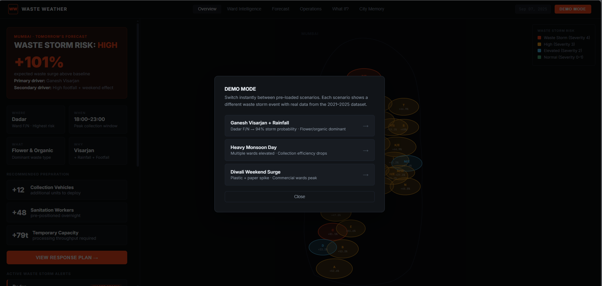
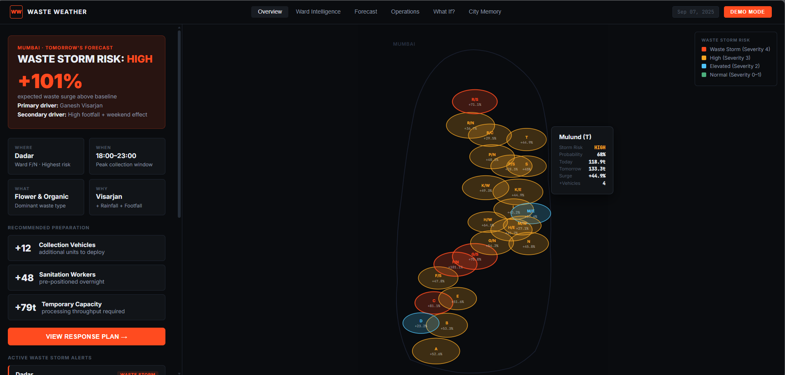
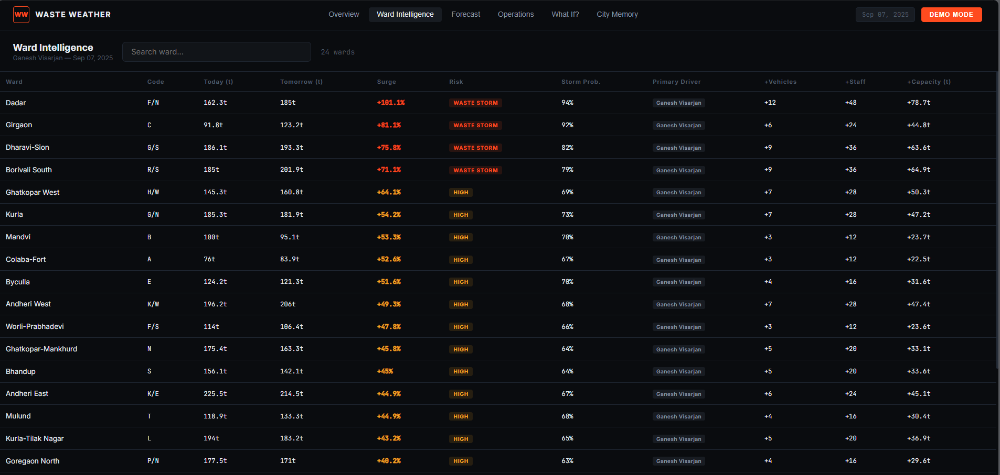
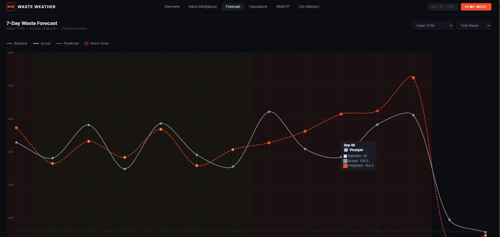
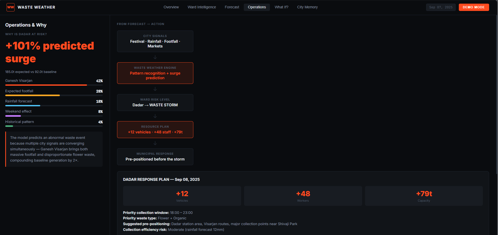
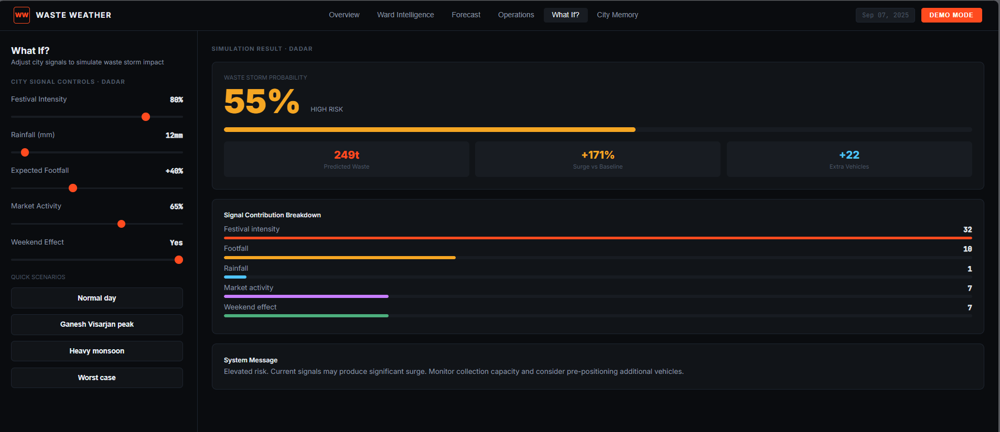
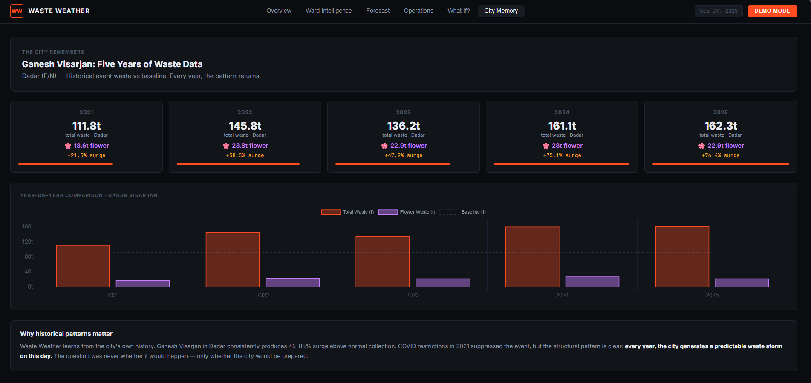

# WASTE WEATHER
### Predict the city's next waste storm.

> **Weather forecasts tell a city when to prepare for rain.**
> **Waste Weather tells a city when to prepare for waste.**

---

Mumbai has a weather department. It doesn't have a waste-weather department — yet.

Every year, Ganesh Visarjan, Diwali, Eid, heavy monsoon rains, and weekend market surges cause predictable waste storms in specific wards. Municipal teams are almost always caught reacting: vehicles scramble after overflow has already happened, sanitation workers are deployed hours late, and the city spends more on cleanup than it would have spent on preparation.

Waste Weather is a **predictive operational intelligence system** for abnormal waste events. It reads the city's calendar, weather, footfall, and historical patterns — and tells municipal operations, before the storm arrives, exactly where to deploy, what to expect, and how much.

---

## The core idea

Cities experience two kinds of weather.

The first kind — rain, heat, humidity — has been forecast for over a century. The second kind — waste surges driven by festivals, markets, monsoons, and human activity — is still managed reactively.

Waste Weather treats **the city calendar as an environmental sensor**. A festival on the calendar is as predictable as a low-pressure system on a weather map. The question isn't whether Ganesh Visarjan will generate a waste surge in Dadar — it will, every single year. The question is whether the city has enough information, early enough, to prepare.

```
CITY SIGNALS          →    WASTE WEATHER ENGINE    →    WARD RISK    →    RESOURCE PLAN
Festival calendar               Pattern matching           Where?           +N vehicles
Weather forecast                Surge prediction           When?            +N workers  
Footfall data                   Composition forecast       What?            +N tonnes
Market activity                 Explainability layer       Why?             Priority zones
Historical waste data
```

---

## Demo

Open `index.html` in any modern browser. No server, no dependencies, no login.

Hit **DEMO MODE** in the top-right corner to switch instantly between three pre-loaded scenarios:

<table align="center">
  <tr>
    <td style="border: 2px solid #30363d; border-radius: 10px; padding: 0;">
      
    </td>
  </tr>
</table>

<table align="center" width="900">
  <thead>
    <tr>
      <th>Scenario</th>
      <th>Peak Ward</th>
      <th>Storm Probability</th>
      <th>Dominant Waste</th>
    </tr>
  </thead>
  <tbody>
    <tr>
      <td>Ganesh Visarjan + Rainfall</td>
      <td>Dadar (F/N)</td>
      <td>94%</td>
      <td>Flower + Organic</td>
    </tr>
    <tr>
      <td>Heavy Monsoon</td>
      <td>Dharavi-Sion (G/S)</td>
      <td>71%</td>
      <td>Mixed / Collection overflow</td>
    </tr>
    <tr>
      <td>Diwali Weekend</td>
      <td>Andheri East (K/E)</td>
      <td>72%</td>
      <td>Plastic + Paper</td>
    </tr>
  </tbody>
</table>


**Live demo flow:**
1. Open Overview → **WASTE STORM RISK: HIGH** is immediately visible
2. Point to Dadar on the ward map → click → detail panel shows +101% surge
3. Navigate to **Operations** → see the WHY breakdown (Visarjan 42%, footfall 28%, rainfall 18%)
4. Open **What If?** → drag rainfall to 120mm → probability climbs past 90%
5. Switch to **City Memory** → show that this exact pattern has repeated every year since 2021

---

## What the system predicts

Waste Weather does not simply predict "more waste tomorrow." It predicts:

- **Where** — which ward will be affected, ranked by storm severity
- **When** — peak collection window (e.g. 18:00–23:00 on Visarjan night)
- **What** — dominant waste type (flower, organic, plastic, paper, mixed)
- **Why** — which city signals are driving the prediction, with contribution weights
- **How much** — expected tonnes above baseline
- **What to do** — exact number of extra vehicles, workers, and processing capacity needed

---

## Screens

### Overview

<table align="center">
  <tr>
    <td style="border: 2px solid #30363d; border-radius: 10px; padding: 0;">
      
    </td>
  </tr>
</table>

City-level command view. Storm risk classification, four-question summary (WHERE / WHEN / WHAT / WHY), recommended resource deployment, and the interactive ward map. Every ward is color-coded by severity. Click any ward for a pinned detail panel.

### Ward Intelligence

<table align="center">
  <tr>
    <td style="border: 2px solid #30363d; border-radius: 10px; padding: 0;">
      
    </td>
  </tr>
</table>


Searchable table of all 24 Mumbai wards. Sortable by storm probability, surge %, driver, and recommended resources. One click to jump back to the map focused on that ward.

### Forecast

<table align="center">
  <tr>
    <td style="border: 2px solid #30363d; border-radius: 10px; padding: 0;">
      
    </td>
  </tr>
</table>


14-day waste forecast chart for any selected ward. Shows actual historical waste, the model's predictions, and the baseline — with storm zones shaded in red. Includes tomorrow's expected waste composition as a breakdown bar chart.

### Operations

<table align="center">
  <tr>
    <td style="border: 2px solid #30363d; border-radius: 10px; padding: 0;">
      
    </td>
  </tr>
</table>


The full prediction-to-action pipeline. Signal contribution bars show exactly why a ward is at risk. Response plan gives specific pre-positioning instructions: priority routes, collection window, waste type priority, and resource numbers.

### What If?

<table align="center">
  <tr>
    <td style="border: 2px solid #30363d; border-radius: 10px; padding: 0;">
      
    </td>
  </tr>
</table>


Decision-support simulator. Five city-signal sliders (festival intensity, rainfall, footfall, market activity, weekend toggle) dynamically recalculate storm probability, predicted waste, surge %, and additional vehicles required. Useful for planning meetings and contingency scenarios.

### City Memory

<table align="center">
  <tr>
    <td style="border: 2px solid #30363d; border-radius: 10px; padding: 0;">
      
    </td>
  </tr>
</table>


Year-on-year historical comparison for key events. Shows that Ganesh Visarjan in Dadar has produced a waste surge every single year from 2021 to 2025 — with COVID restrictions visible as a structural dip in 2021. The system learns from patterns that repeat.

---

## Dataset

The prototype runs on a synthetic but realistic dataset generated for this project. It is explicitly **not** official BMC data — it is a hackathon simulation designed to demonstrate the prediction approach with plausible Mumbai-scale numbers.

### Files

| File | Rows | Description |
|---|---|---|
| `mumbai_waste_daily_2021_2025.csv` | ~43,800 | Daily ward-level observations and predictions |
| `mumbai_ward_metadata.csv` | 24 | Ward characteristics and baseline parameters |

### Daily dataset columns (63 total)

**Temporal**
`date`, `year`, `month`, `day_of_week`, `week_of_year`, `is_weekend`, `is_public_holiday`

**Weather**
`rainfall_mm`, `temperature_c`, `humidity_pct`, `wind_speed_kmph`, `weather_condition`, `monsoon_intensity`

**Events**
`event_name`, `event_type`, `event_intensity`, `expected_footfall`, `festival_waste_multiplier`

**Activity indices** (0–100 scale)
`mobility_index`, `market_activity_index`, `commercial_footfall_index`, `residential_footfall_index`, `restaurant_activity_index`, `tourist_activity_index`, `office_activity_index`, `school_activity_index`, `street_vendor_activity_index`

**COVID context**
`covid_restriction_level` (0–4), with downstream effects on all activity indices

**Waste generation**
`total_waste_tonnes`, `organic_waste_tonnes`, `food_waste_tonnes`, `plastic_waste_tonnes`, `paper_waste_tonnes`, `glass_waste_tonnes`, `metal_waste_tonnes`, `construction_waste_tonnes`, `flower_waste_tonnes`, `other_waste_tonnes`

**Collection operations**
`scheduled_collection_capacity_tonnes`, `actual_collected_tonnes`, `uncollected_waste_tonnes`, `collection_vehicle_count`, `collection_staff_count`, `collection_delay_hours`, `overflow_incidents`

**ML targets** (do not use as input features)
`next_day_total_waste_tonnes`, `next_day_waste_surge_pct`, `waste_storm_probability`, `waste_storm_severity` (0–4), `recommended_extra_vehicles`, `recommended_extra_staff`, `recommended_extra_capacity_tonnes`

**Explainability**
`dominant_waste_type`, `waste_profile`, `primary_surge_driver`, `secondary_surge_driver`, `predicted_reason`

**Split**
`dataset_split`: `train` (2021–2023) · `validation` (2024) · `test` (2025)

### Ward metadata columns

`ward_code`, `ward_name`, `population_estimate`, `population_density`, `residential_index`, `commercial_index`, `market_index`, `industrial_index`, `tourism_index`, `restaurant_density_index`, `festival_activity_index`, `baseline_daily_waste_tonnes`, `typical_collection_capacity_tonnes`, `vehicle_base_count`, `staff_base_count`

### Key causal relationships in the data

The dataset encodes realistic signal chains, not random noise:

- Festival intensity × festival_activity_index → waste multiplier
- Ganesh Visarjan → disproportionate `flower_waste_tonnes` spike in high-festival wards
- Rainfall > 80mm → `collection_delay_hours` increases, `overflow_incidents` increases
- COVID restriction level → suppresses mobility, commercial activity, event multipliers
- Weekend + high `market_index` → elevated food and organic waste
- `waste_storm_probability` > 0.75 → `waste_storm_severity` = 4 (Extreme)

---

## Training a real model

The dataset is structured for time-series prediction. **Never use future-leaking columns as input features.**

### Input features (safe to use)
All weather columns, all activity indices, all event columns, COVID context, ward metadata, the current day's actual waste generation, and lagged waste values.

### Target variables (predict these)
`waste_storm_probability`, `waste_storm_severity`, `next_day_waste_surge_pct`, `recommended_extra_vehicles`, `recommended_extra_staff`

### Suggested baseline models

**XGBoost / LightGBM** — best for tabular data with mixed feature types. Use `waste_storm_probability` as a regression target or binarize at 0.5 for classification.

**Random Forest** — interpretable baseline, good for understanding feature importance. Festival and footfall columns will likely dominate.

**Time-series baseline** — for each ward, predict tomorrow = exponentially weighted average of last 7 days. Useful as a floor to beat.

### Train / validation / test split

```
Train      2021 – 2023    ~26,280 rows per ward
Validation 2024            ~8,784 rows
Test       2025            ~8,760 rows
```

**Do not shuffle rows.** This is time-series data. Random shuffling will cause target leakage from future dates.

### Evaluation metrics

| Task | Metric |
|---|---|
| Waste storm classification | F1, Precision, Recall, ROC-AUC |
| Surge % prediction | MAE, RMSE |
| Severity level | Weighted F1 (4-class) |
| Resource recommendation | MAE (vehicles), MAE (staff) |

---

## Project structure

```
waste-weather/
├── waste_weather.html              # Self-contained interactive prototype
├── README.md                       # This file
├── data/
│   ├── mumbai_waste_daily_2021_2025.csv
│   └── mumbai_ward_metadata.csv
└── data_generation/
    └── generate_dataset.py         # Synthetic data generation script
```

---

## Wards covered

24 Mumbai administrative wards, from Colaba-Fort (A) in the south to Mulund (T) in the north:

`A · B · C · D · E · F/S · F/N · G/S · G/N · H/E · H/W · K/E · K/W · P/N · P/S · R/N · R/C · R/S · L · M/E · M/W · N · S · T`

Each ward has a distinct baseline, festival activity index, commercial profile, and population density — so predictions are meaningfully different across the city rather than uniform.

---

## Technical notes

**The prototype is a single self-contained HTML file.** It requires no build step, no server, no API keys, and no internet connection after the Google Fonts request. Chart.js is loaded from cdnjs.

**The ward map is SVG-based**, using schematic ellipses positioned to approximate Mumbai's geography from south (Colaba) to north (Mulund/Borivali). No map API is required.

**All data shown in the UI is drawn from the actual CSV dataset**, extracted and embedded as JavaScript constants. The What If? simulator applies a transparent linear model to the slider values — the formula is visible in the source.

---

## What this is not

Waste Weather is not a generic waste management dashboard. It is not a real-time IoT monitoring system. It is not an AI chatbot. It does not connect to live BMC data.

It is a **predictive operations layer** — the missing piece between the city's existing data (calendar, weather, historical waste) and the decisions municipal teams need to make the night before a major event.

The central claim is straightforward: if a city knows Ganesh Visarjan is tomorrow, knows the footfall forecast, knows the rainfall, and knows that Dadar produced a 76% waste surge last year on the same day — it has enough information to pre-position resources tonight. It just needs a system that connects those signals to an operational recommendation.

That is what Waste Weather does.

---

## Data disclaimer

The dataset (`mumbai_waste_daily_2021_2025.csv`) is **synthetic and simulated**, generated for hackathon prototyping purposes. It is not official BMC (Brihanmumbai Municipal Corporation) data. Ward boundaries, population figures, and waste tonnage are approximations intended to be plausible at city scale, not precise municipal records.

---

*Built for hackathon demonstration. Synthetic dataset. Not official municipal data.*
